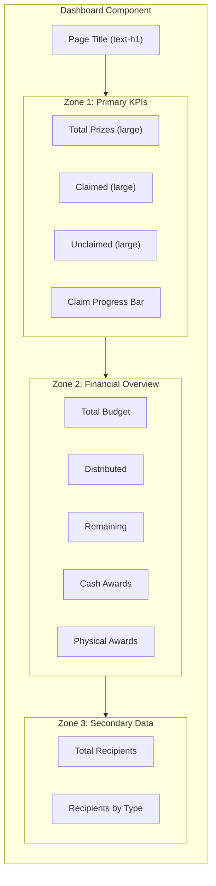
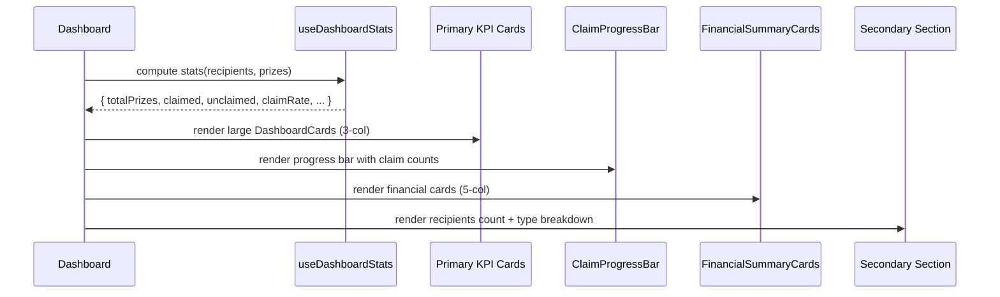

# Design Document: Dashboard Information Hierarchy

## Overview

The dashboard currently suffers from weak visual hierarchy — all metrics compete for equal attention, spacing is uniform without intentional breathing room, and the relationship between related data points (e.g., claimed/unclaimed counts and the progress bar) is not visually obvious. This design restructures the dashboard into clearly defined visual zones with differentiated typography, spacing, and component sizing to create an immediately scannable information architecture.

The approach introduces three distinct visual tiers: **Primary KPIs** (large, prominent cards for the most critical numbers), **Financial Overview** (medium-weight section with clear heading), and **Secondary Data** (compact supporting information). The existing `DashboardCard` component gains a `size` prop to support large/default variants, and the layout uses intentional spacing gaps between zones rather than uniform `space-y-6`.

All changes are purely presentational — no data logic, hooks, or state management changes are required. The design preserves WCAG AA accessibility compliance and responsive behavior.

## Architecture



## Sequence Diagrams

### Dashboard Render Flow



## Components and Interfaces

### Component 1: DashboardCard (Enhanced)

**Purpose**: Renders a single KPI metric card with support for two size variants — `large` for primary KPIs and `default` for secondary data.

**Interface**:
```typescript
interface DashboardCardProps {
  label: string;
  value: number | string;
  variant?: 'default' | 'success' | 'warning';
  size?: 'default' | 'large';
}
```

**Responsibilities**:
- Render a metric value with its label inside a Card
- Apply size-dependent padding, typography, and spacing
- Apply variant-specific left border color
- Maintain WCAG AA contrast ratios at all sizes

**Size Variant Styling**:
| Property | `default` | `large` |
|----------|-----------|---------|
| Card padding | `p-4` | `p-6` |
| Value typography | `text-display text-neutral-900` | `text-display text-neutral-900` (larger via font-size override or custom class) |
| Label typography | `text-body-sm text-neutral-500` | `text-body text-neutral-600` |
| Gap between value/label | `gap-1` | `gap-2` |

### Component 2: ClaimProgressBar (New)

**Purpose**: A more prominent, self-contained progress bar component that visually connects claim statistics with the progress visualization. Replaces the inline progress bar markup in Dashboard.

**Interface**:
```typescript
interface ClaimProgressBarProps {
  claimed: number;
  unclaimed: number;
  claimRate: number;
}
```

**Responsibilities**:
- Render a taller progress bar (h-3 instead of h-2) for better visibility
- Display claimed/unclaimed counts flanking the bar
- Show percentage prominently
- Use semantic `role="progressbar"` with proper ARIA attributes
- Animate width transitions using `duration-slow` token

### Component 3: SectionHeading (New Utility)

**Purpose**: Provides consistent section heading typography across dashboard zones, replacing ad-hoc heading styles.

**Interface**:
```typescript
interface SectionHeadingProps {
  children: React.ReactNode;
  as?: 'h2' | 'h3';
}
```

**Responsibilities**:
- Render heading with `text-h3 font-semibold text-neutral-800` styling
- Support semantic heading level selection
- Provide consistent spacing via wrapper margin

### Component 4: Dashboard (Restructured Layout)

**Purpose**: Orchestrates the three visual zones with intentional spacing hierarchy.

**Updated Layout Structure**:
```typescript
// Zone spacing rhythm (uses 4px-base token system):
// Page title → Zone 1: space-y-8 (32px)
// Within Zone 1: space-y-4 (16px) between cards and progress bar
// Zone 1 → Zone 2: space-y-10 (40px) — largest gap for clear separation
// Zone 2 → Zone 3: space-y-10 (40px)
// Within zones: space-y-4 (16px)
```

## Data Models

### Existing Types (No Changes)

```typescript
// These remain unchanged — the redesign is purely presentational
interface DashboardStats {
  totalRecipients: number;
  totalPrizes: number;
  claimedCount: number;
  unclaimedCount: number;
  claimRate: number;
  typeBreakdown: { type: RecipientType; count: number }[];
}
```

### New: Size Variant Map

```typescript
const sizeClasses: Record<'default' | 'large', {
  card: string;
  value: string;
  label: string;
  gap: string;
}> = {
  default: {
    card: 'p-4',
    value: 'text-display text-neutral-900',
    label: 'text-body-sm text-neutral-500',
    gap: 'gap-1',
  },
  large: {
    card: 'p-6',
    value: 'text-display text-neutral-900 text-4xl',
    label: 'text-body text-neutral-600',
    gap: 'gap-2',
  },
};
```

## Error Handling

### Error Scenario 1: Empty Data State

**Condition**: Both `recipients` and `prizes` arrays are empty
**Response**: Show existing `EmptyState` component (no change needed)
**Recovery**: User adds data via Prizes or Recipients tabs

### Error Scenario 2: Zero Prizes (No Progress Bar)

**Condition**: `prizes.length === 0` but `recipients.length > 0`
**Response**: Hide the ClaimProgressBar component entirely (avoid 0/0 display)
**Recovery**: Automatic — bar appears once prizes are added

### Error Scenario 3: Extremely Large Numbers

**Condition**: Value exceeds typical display width (e.g., 1,000,000+)
**Response**: Numbers should use compact notation or truncate naturally within card bounds via `overflow-hidden` and responsive font sizing
**Recovery**: Not applicable — purely visual accommodation

## Testing Strategy

### Unit Testing Approach

- **DashboardCard size variants**: Verify that `size="large"` applies correct CSS classes (p-6, larger text, gap-2)
- **DashboardCard default behavior**: Ensure backward compatibility — omitting `size` prop renders default styling
- **ClaimProgressBar**: Test ARIA attributes match provided values, verify percentage display
- **SectionHeading**: Test semantic heading level rendering (h2 vs h3)

### Property-Based Testing Approach

**Property Test Library**: fast-check

- **DashboardCard value display**: For any numeric value, the rendered output contains that exact number
- **ClaimProgressBar percentage**: For any claimed/total combination, the displayed percentage equals `Math.round((claimed / total) * 100)`
- **Progress bar width**: The CSS width percentage matches the claimRate prop (within rounding)

### Integration Testing Approach

- **Dashboard layout zones**: Verify that the DOM structure maintains the correct zone ordering (Primary KPIs → Financial → Secondary)
- **Responsive breakpoints**: Test that grid columns collapse correctly at md and xl breakpoints
- **Accessibility audit**: Run axe-core against the full dashboard to verify WCAG AA compliance after changes

## Performance Considerations

- **No new data fetching**: All changes are CSS/layout only — no additional renders or state computations
- **Minimal DOM changes**: The restructuring adds at most 2-3 wrapper `<div>` elements for zone grouping
- **CSS-only transitions**: Progress bar animation uses `transition-all duration-slow` which is GPU-accelerated via transform
- **No layout thrashing**: All size variants use fixed Tailwind classes — no runtime style calculations

## Security Considerations

- No security implications — this is a purely presentational change with no user input handling, API calls, or data mutation
- All rendered values are already sanitized by React's JSX escaping

## Dependencies

- **Existing**: React 19, TypeScript, Tailwind CSS, existing design tokens
- **No new dependencies required**
- **Design tokens used**: TYPOGRAPHY (display, h1, h3, body, body-sm), SPACING (4, 6, 8, 10), COLORS (primary, success, warning, neutral), SHADOWS (sm), RADII (lg, full), TRANSITIONS (slow)

---

## Detailed Layout Specification

### Page Title

```typescript
// Before: text-h2 text-neutral-900
// After: text-h1 text-neutral-900
<h1 className="text-h1 text-neutral-900">Dashboard</h1>
```

**Rationale**: The page title is the highest-level heading on the page. Using `text-h1` (1.875rem/700) establishes clear dominance over section headings (`text-h3` at 1.25rem/600).

### Zone 1: Primary KPIs + Claim Progress

```typescript
<div className="space-y-4">
  {/* Primary KPI cards in 3-column grid */}
  <div className="grid grid-cols-1 md:grid-cols-3 gap-4">
    <DashboardCard label="Total Prizes" value={totalPrizes} size="large" />
    <DashboardCard label="Claimed" value={claimedCount} variant="success" size="large" />
    <DashboardCard label="Unclaimed" value={unclaimedCount} variant="warning" size="large" />
  </div>

  {/* Claim Progress - visually connected to the KPIs above */}
  <ClaimProgressBar
    claimed={claimedCount}
    unclaimed={unclaimedCount}
    claimRate={claimRate}
  />
</div>
```

**Rationale**: Moving Total Recipients to Zone 3 and promoting Total Prizes, Claimed, and Unclaimed to large cards makes the most actionable data (prize claim status) immediately scannable. The progress bar sits directly below its related KPIs, eliminating the visual disconnect.

### Zone 2: Financial Overview

```typescript
<div className="space-y-4">
  <SectionHeading>Financial Summary</SectionHeading>
  <FinancialSummaryCards prizes={prizes} />
</div>
```

**Changes to FinancialSummaryCards**:
- Replace inline `<h2 className="text-body-sm font-medium text-neutral-700">` with the `SectionHeading` component
- Cards retain their current styling (default size) — they are secondary to the primary KPIs

### Zone 3: Secondary Data

```typescript
<div className="space-y-4">
  <SectionHeading>Overview</SectionHeading>
  <div className="grid grid-cols-1 md:grid-cols-2 gap-4">
    <DashboardCard label="Total Recipients" value={totalRecipients} />
    {/* Recipients by Type - badge pills */}
    <Card className="p-4">
      <div className="space-y-2">
        <span className="text-body-sm font-medium text-neutral-600">Recipients by Type</span>
        <div className="flex flex-wrap gap-2">
          {typeBreakdown.map(...)}
        </div>
      </div>
    </Card>
  </div>
</div>
```

**Rationale**: Total Recipients is useful context but not the primary actionable metric. Grouping it with the type breakdown in a secondary zone de-emphasizes it appropriately.

### Spacing Between Zones

```typescript
<section className="space-y-10">
  {/* Page Title */}
  <h1 className="text-h1 text-neutral-900">Dashboard</h1>
  
  {/* Zone 1: Primary KPIs + Progress */}
  <div className="space-y-4">...</div>
  
  {/* Zone 2: Financial Overview */}
  <div className="space-y-4">...</div>
  
  {/* Zone 3: Secondary Data */}
  <div className="space-y-4">...</div>
</section>
```

**Rationale**: Using `space-y-10` (40px) between zones creates clear visual separation between information groups, while `space-y-4` (16px) within zones keeps related content cohesive. This establishes a 2.5:1 ratio between inter-zone and intra-zone spacing.

### ClaimProgressBar Detailed Design

```typescript
function ClaimProgressBar({ claimed, unclaimed, claimRate }: ClaimProgressBarProps) {
  return (
    <Card className="p-5">
      <div className="space-y-3">
        {/* Header row with counts */}
        <div className="flex items-center justify-between">
          <span className="text-body font-medium text-neutral-700">Claim Progress</span>
          <span className="text-h3 font-semibold text-primary-700">
            {Math.round(claimRate)}%
          </span>
        </div>

        {/* Progress bar - taller for prominence */}
        <div
          className="w-full h-3 bg-neutral-200 rounded-full overflow-hidden"
          role="progressbar"
          aria-valuenow={Math.round(claimRate)}
          aria-valuemin={0}
          aria-valuemax={100}
          aria-label="Prize claim completion"
        >
          <div
            className="h-full bg-primary-500 rounded-full transition-all duration-slow"
            style={{ width: `${claimRate}%` }}
          />
        </div>

        {/* Contextual counts */}
        <div className="flex items-center justify-between text-body-sm">
          <span className="text-success-700 font-medium">{claimed} claimed</span>
          <span className="text-warning-700 font-medium">{unclaimed} unclaimed</span>
        </div>
      </div>
    </Card>
  );
}
```

**Rationale**: Wrapping the progress bar in a Card elevates its visual prominence. The claimed/unclaimed counts flanking the bar create a direct visual connection to the KPI cards above. The percentage is displayed in `text-h3` weight to be immediately scannable.

---

## Correctness Properties

*A property is a characteristic or behavior that should hold true across all valid executions of a system — essentially, a formal statement about what the system should do. Properties serve as the bridge between human-readable specifications and machine-verifiable correctness guarantees.*

### Property 1: Zone DOM Ordering

*For any* valid set of recipients and prizes data (where at least one array is non-empty), the Dashboard SHALL render DOM nodes in the fixed order: page title, then Primary_KPIs zone, then Financial_Overview zone, then Secondary_Data zone.

**Validates: Requirement 1.1**

### Property 2: Primary KPI Zone Structure

*For any* non-empty prizes array, the Primary_KPIs zone SHALL contain exactly three DashboardCard components (with size="large") and one ClaimProgressBar component.

**Validates: Requirement 1.2**

### Property 3: DashboardCard Default Size Styling

*For any* valid label and value, when the DashboardCard `size` prop is omitted or set to "default", the card SHALL render with padding class `p-4`, label class `text-body-sm text-neutral-500`, and internal gap class `gap-1`.

**Validates: Requirements 2.2, 8.4**

### Property 4: DashboardCard Large Size Styling

*For any* valid label and value, when the DashboardCard `size` prop is "large", the card SHALL render with padding class `p-6`, label class `text-body text-neutral-600`, internal gap class `gap-2`, and a larger font size on the value element compared to the default variant.

**Validates: Requirements 2.3, 2.4, 6.4**

### Property 5: DashboardCard Variant Border Independence

*For any* combination of variant (default, success, warning) and size (default, large), the rendered border color class SHALL depend only on the variant prop and remain unchanged by the size prop.

**Validates: Requirement 2.5**

### Property 6: DashboardCard Value Typography

*For any* valid DashboardCard props with either size variant, the value element SHALL contain the `text-display` class.

**Validates: Requirement 6.3**

### Property 7: ClaimProgressBar ARIA Correctness

*For any* claimRate value in the range [0, 100], the ClaimProgressBar progress bar element SHALL have `aria-valuenow` equal to `Math.round(claimRate)`, `aria-valuemin` equal to 0, and `aria-valuemax` equal to 100.

**Validates: Requirements 3.3, 9.3**

### Property 8: ClaimProgressBar Width Matches Claim Rate

*For any* claimRate value, the ClaimProgressBar inner bar inline style width SHALL equal `${claimRate}%`.

**Validates: Requirement 3.4**

### Property 9: SectionHeading Element Type

*For any* value of the `as` prop ("h2" or "h3"), the SectionHeading SHALL render the corresponding HTML heading element. When the `as` prop is omitted, SectionHeading SHALL render an `h2` element.

**Validates: Requirements 4.2, 4.3, 9.2**

### Property 10: SectionHeading Consistent Styling

*For any* children content and any `as` prop value, the SectionHeading rendered element SHALL contain classes `text-h3`, `font-semibold`, and `text-neutral-800`.

**Validates: Requirements 4.1, 6.2**

### Property 11: DashboardCard Accessible Value Announcement

*For any* valid DashboardCard props (any label, value, variant, size combination), the value element SHALL include the attribute `aria-live="polite"`.

**Validates: Requirement 9.4**

### Property 12: Data Completeness

*For any* valid non-empty recipients and prizes arrays, the rendered Dashboard output SHALL contain all computed stat values (totalRecipients, totalPrizes, claimedCount, unclaimedCount, claimRate percentage) as visible text.

**Validates: Requirement 8.2**
