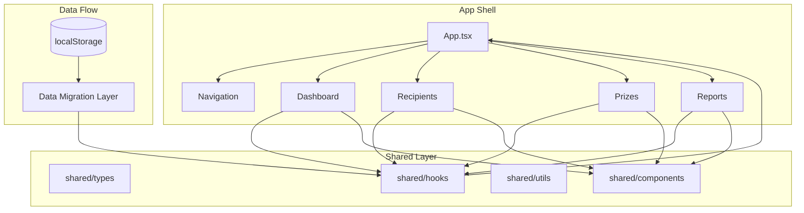
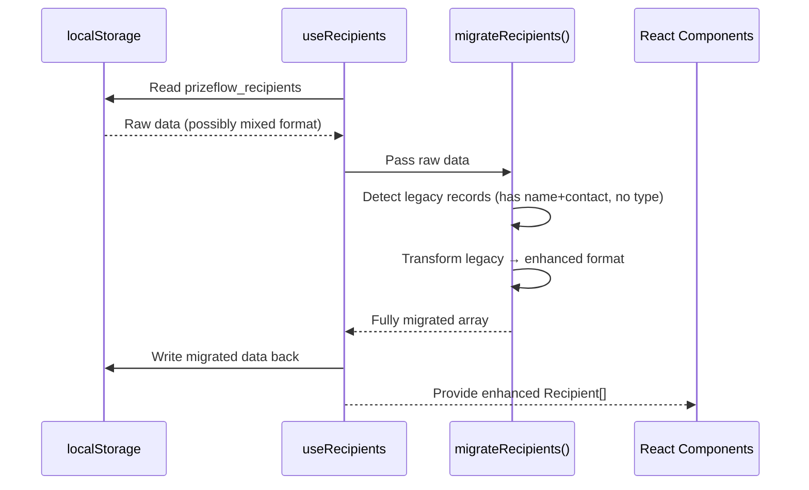

# Technical Design: Multi-Recipient Types

## Overview

This design extends PrizeFlow's recipient system from a single "individual" model (`{ id, name, contact }`) to a rich, type-aware system supporting seven recipient classifications: Individual, Team, Class, Department, Organization, Club, and Other. The enhancement touches data modeling, form rendering, search/filtering, dashboard analytics, reports/CSV export, and backward-compatible data migration.

The design follows the existing feature-module architecture, keeping all new shared logic in `shared/` (hooks, utils, types, components) and feature-specific UI in each respective feature folder. No external service dependencies are introduced — all persistence remains in localStorage.

## Architecture

### High-Level Architecture



### Data Flow for Migration



### Module Dependency Rules (Preserved)

- Feature modules (`features/*`) import only from `shared/`
- Feature modules NEVER import from other feature modules
- `shared/` contains types, hooks, utils, and reusable components
- App.tsx orchestrates features and passes shared state via props

## Components and Interfaces

### New Shared Components

#### Select Component
A native `<select>` wrapper with consistent styling, label, error state, and ARIA attributes.

```typescript
interface SelectProps {
  label: string;
  value: string;
  onChange: (value: string) => void;
  options: { value: string; label: string }[];
  required?: boolean;
  error?: string;
  'aria-describedby'?: string;
}
```

#### TagInput Component
A tag-based input for the members list with add/remove functionality and bulk import support.

```typescript
interface TagInputProps {
  label: string;
  tags: string[];
  onAdd: (name: string) => void;
  onRemove: (index: number) => void;
  onBulkImport: (text: string) => void;
  placeholder?: string;
}
```

#### FilterPills Component
Horizontal pills for selecting one or more recipient types as active filters.

```typescript
interface FilterPillsProps {
  options: { value: string; label: string; color: string }[];
  selected: string[];
  onChange: (selected: string[]) => void;
  'aria-label'?: string;
}
```

### Modified Components

#### RecipientForm (Complete Rewrite)
Replaces the current simple name+contact form with a type-aware, config-driven form.

```typescript
interface RecipientFormProps {
  onSubmit: (data: RecipientFormData) => void;
  onCancel: () => void;
  initialData?: Partial<Recipient>;
  triggerRef?: React.RefObject<HTMLElement | null>;
}

interface RecipientFormData {
  type: RecipientType;
  displayName: string;
  contactPerson: string;
  contactInfo: string;
  members: string[];
  notes: string;
  customLabel: string;
}
```

#### RecipientRow (Extended)
Adds type badge and quick stats display.

```typescript
interface RecipientRowProps {
  recipient: Recipient;
  prizeSummary: { assigned: number; claimed: number };
  onEdit: (recipient: Recipient) => void;
  onDelete: (recipient: Recipient) => void;
  onDuplicate: (recipient: Recipient) => void;
}
```

#### RecipientList (Extended)
Adds type filter pills above the existing search input.

#### Dashboard (Extended)
Adds a recipient type breakdown section below existing cards.

#### Reports (Extended)
Adds Recipient Type column and group-by-type toggle.

#### PrizeRow/Prize Assignment (Extended)
Prize assignment selector grouped by recipient type with type-ahead search.

### New Hooks

#### useRecipientFilter
Combines type filter state and text search into a single filtering hook.

```typescript
interface UseRecipientFilterReturn {
  selectedTypes: RecipientType[];
  setSelectedTypes: (types: RecipientType[]) => void;
  searchQuery: string;
  setSearchQuery: (query: string) => void;
  filterRecipients: (recipients: Recipient[]) => Recipient[];
}
```

### Modified Hooks

#### useRecipients (Extended)
- On mount: runs migration logic on raw localStorage data
- New methods: `addRecipient(data: RecipientFormData)`, `duplicateRecipient(id: string)`
- Updated `updateRecipient` signature to accept enhanced fields

### Configuration Objects

#### FORM_FIELDS_BY_TYPE
A config map that drives conditional field rendering:

```typescript
type FieldConfig = {
  fieldName: keyof RecipientFormData;
  label: string;
  required: boolean;
  placeholder: string;
  type: 'text' | 'textarea' | 'tag-input';
};

const FORM_FIELDS_BY_TYPE: Record<RecipientType, FieldConfig[]> = {
  individual: [
    { fieldName: 'displayName', label: 'Name', required: true, placeholder: 'Recipient name', type: 'text' },
    { fieldName: 'contactInfo', label: 'Contact', required: false, placeholder: 'Email or phone', type: 'text' },
  ],
  team: [
    { fieldName: 'displayName', label: 'Team Name', required: true, placeholder: 'Team name', type: 'text' },
    { fieldName: 'contactPerson', label: 'Captain', required: false, placeholder: 'Team captain', type: 'text' },
    { fieldName: 'members', label: 'Members', required: false, placeholder: 'Add team members', type: 'tag-input' },
    { fieldName: 'notes', label: 'Notes', required: false, placeholder: 'Additional notes', type: 'textarea' },
  ],
  class: [
    { fieldName: 'displayName', label: 'Class Name', required: true, placeholder: 'Class name', type: 'text' },
    { fieldName: 'contactPerson', label: 'Teacher/Advisor', required: false, placeholder: 'Teacher or advisor name', type: 'text' },
    { fieldName: 'notes', label: 'Notes', required: false, placeholder: 'Additional notes', type: 'textarea' },
  ],
  department: [
    { fieldName: 'displayName', label: 'Department Name', required: true, placeholder: 'Department name', type: 'text' },
    { fieldName: 'contactPerson', label: 'Department Head', required: false, placeholder: 'Department head name', type: 'text' },
    { fieldName: 'contactInfo', label: 'Contact', required: false, placeholder: 'Department contact', type: 'text' },
    { fieldName: 'notes', label: 'Notes', required: false, placeholder: 'Additional notes', type: 'textarea' },
  ],
  organization: [
    { fieldName: 'displayName', label: 'Organization Name', required: true, placeholder: 'Organization name', type: 'text' },
    { fieldName: 'contactPerson', label: 'Representative', required: false, placeholder: 'Organization representative', type: 'text' },
    { fieldName: 'contactInfo', label: 'Contact', required: false, placeholder: 'Organization contact', type: 'text' },
    { fieldName: 'members', label: 'Members', required: false, placeholder: 'Add members', type: 'tag-input' },
    { fieldName: 'notes', label: 'Notes', required: false, placeholder: 'Additional notes', type: 'textarea' },
  ],
  club: [
    { fieldName: 'displayName', label: 'Club Name', required: true, placeholder: 'Club name', type: 'text' },
    { fieldName: 'contactPerson', label: 'President', required: false, placeholder: 'Club president', type: 'text' },
    { fieldName: 'members', label: 'Members', required: false, placeholder: 'Add club members', type: 'tag-input' },
    { fieldName: 'notes', label: 'Notes', required: false, placeholder: 'Additional notes', type: 'textarea' },
  ],
  other: [
    { fieldName: 'displayName', label: 'Name', required: true, placeholder: 'Recipient name', type: 'text' },
    { fieldName: 'customLabel', label: 'Type Label', required: true, placeholder: 'e.g., "Squad", "House"', type: 'text' },
    { fieldName: 'contactPerson', label: 'Contact Person', required: false, placeholder: 'Primary contact', type: 'text' },
    { fieldName: 'contactInfo', label: 'Contact Info', required: false, placeholder: 'Email or phone', type: 'text' },
    { fieldName: 'notes', label: 'Notes', required: false, placeholder: 'Additional notes', type: 'textarea' },
  ],
};
```

#### TYPE_BADGE_CONFIG
Color mapping for type badges:

```typescript
const TYPE_BADGE_CONFIG: Record<RecipientType, { label: string; variant: string; classes: string }> = {
  individual: { label: 'Individual', variant: 'neutral', classes: 'bg-neutral-100 text-neutral-700 ring-neutral-600/20' },
  team:         { label: 'Team', variant: 'primary', classes: 'bg-primary-100 text-primary-700 ring-primary-600/20' },
  class:        { label: 'Class', variant: 'success', classes: 'bg-success-100 text-success-700 ring-success-600/20' },
  department:   { label: 'Department', variant: 'warning', classes: 'bg-warning-100 text-warning-700 ring-warning-600/20' },
  organization: { label: 'Organization', variant: 'danger', classes: 'bg-danger-100 text-danger-700 ring-danger-600/20' },
  club:         { label: 'Club', variant: 'primary-light', classes: 'bg-primary-50 text-primary-600 ring-primary-400/20' },
  other:        { label: 'Other', variant: 'neutral-dark', classes: 'bg-neutral-200 text-neutral-600 ring-neutral-500/20' },
};
```

## Data Models

### Enhanced Recipient Type

```typescript
export type RecipientType = 'individual' | 'team' | 'class' | 'department' | 'organization' | 'club' | 'other';

export const RECIPIENT_TYPES: RecipientType[] = [
  'individual', 'team', 'class', 'department', 'organization', 'club', 'other'
];

export interface Recipient {
  id: string;
  type: RecipientType;
  displayName: string;
  contactPerson: string;
  contactInfo: string;
  members: string[];
  memberCount: number;
  notes: string;
  customLabel: string; // Required only when type === 'other'
}
```

### Legacy Recipient (for migration detection)

```typescript
export interface LegacyRecipient {
  id: string;
  name: string;
  contact: string;
}
```

### Prize (Unchanged)

```typescript
export interface Prize {
  id: string;
  name: string;
  description: string;
  recipientId: string | null;
  claimed: boolean;
  claimDate: string | null;
}
```

### Migration Logic (Pure Function)

```typescript
function isLegacyRecipient(record: unknown): record is LegacyRecipient {
  return (
    typeof record === 'object' && record !== null &&
    'name' in record && 'contact' in record &&
    !('type' in record)
  );
}

function migrateRecipient(legacy: LegacyRecipient): Recipient {
  return {
    id: legacy.id,
    type: 'individual',
    displayName: legacy.name,
    contactPerson: '',
    contactInfo: legacy.contact,
    members: [],
    memberCount: 0,
    notes: '',
    customLabel: '',
  };
}

function migrateRecipients(records: unknown[]): Recipient[] {
  return records.map(record =>
    isLegacyRecipient(record) ? migrateRecipient(record as LegacyRecipient) : record as Recipient
  );
}
```

### Member Import Parser (Pure Function)

```typescript
function parseBulkMembers(input: string): string[] {
  return input
    .split(/[,\n]/)
    .map(name => name.trim())
    .filter(name => name.length > 0);
}
```

### Recipient Validation (Pure Function)

```typescript
function validateRecipient(data: RecipientFormData): ValidationResult {
  const errors: Record<string, string> = {};

  if (!data.displayName.trim()) {
    errors.displayName = 'Display name is required';
  }

  if (data.type === 'other' && !data.customLabel.trim()) {
    errors.customLabel = 'Custom label is required for "Other" type';
  }

  return { valid: Object.keys(errors).length === 0, errors };
}
```

### Recipient Grouping (Pure Function)

```typescript
function groupRecipientsByType(recipients: Recipient[]): Map<RecipientType, Recipient[]> {
  const groups = new Map<RecipientType, Recipient[]>();
  for (const recipient of recipients) {
    const existing = groups.get(recipient.type) || [];
    existing.push(recipient);
    groups.set(recipient.type, existing);
  }
  return groups;
}
```

### Filter Logic (Pure Function)

```typescript
function filterRecipients(
  recipients: Recipient[],
  selectedTypes: RecipientType[],
  searchQuery: string
): Recipient[] {
  let results = recipients;

  // Type filter
  if (selectedTypes.length > 0) {
    results = results.filter(r => selectedTypes.includes(r.type));
  }

  // Text search (case-insensitive)
  const query = searchQuery.toLowerCase().trim();
  if (query) {
    results = results.filter(r =>
      r.displayName.toLowerCase().includes(query) ||
      r.contactPerson.toLowerCase().includes(query) ||
      r.members.some(m => m.toLowerCase().includes(query))
    );
  }

  return results;
}
```

### Dashboard Breakdown (Pure Function)

```typescript
function computeTypeBreakdown(recipients: Recipient[]): { type: RecipientType; count: number }[] {
  const counts = new Map<RecipientType, number>();
  for (const r of recipients) {
    counts.set(r.type, (counts.get(r.type) || 0) + 1);
  }
  return Array.from(counts.entries())
    .map(([type, count]) => ({ type, count }))
    .filter(entry => entry.count > 0);
}
```

### Quick Stats (Pure Function)

```typescript
function computeQuickStats(recipientId: string, prizes: Prize[]): { assigned: number; claimed: number } {
  const assigned = prizes.filter(p => p.recipientId === recipientId);
  return {
    assigned: assigned.length,
    claimed: assigned.filter(p => p.claimed).length,
  };
}

function formatQuickStat(assigned: number, claimed: number): string {
  if (assigned === 0) return 'No prizes';
  return `${claimed} / ${assigned} claimed`;
}
```

### Duplicate Logic (Pure Function)

```typescript
function duplicateRecipient(original: Recipient): Omit<Recipient, 'id'> {
  return {
    ...original,
    displayName: `${original.displayName} (Copy)`,
    // id is generated fresh by the hook
  };
}
```

## Correctness Properties

*A property is a characteristic or behavior that should hold true across all valid executions of a system — essentially, a formal statement about what the system should do. Properties serve as the bridge between human-readable specifications and machine-verifiable correctness guarantees.*

### Property 1: Migration Integrity

*For any* valid legacy recipient record `{ id, name, contact }`, the `migrateRecipient` function SHALL produce a valid enhanced recipient with `type === 'individual'`, `displayName === name`, `contactInfo === contact`, `id` preserved unchanged, `members === []`, `memberCount === 0`, `contactPerson === ''`, `notes === ''`, and `customLabel === ''`.

**Validates: Requirements 5.1, 5.2, 5.3, 5.6**

### Property 2: Selective Migration Preservation

*For any* array containing a mix of legacy and enhanced recipient records, `migrateRecipients` SHALL transform only the legacy records and return enhanced records byte-for-byte identical to their input.

**Validates: Requirements 5.7**

### Property 3: Type-Conditional Field Configuration

*For any* RecipientType value, `FORM_FIELDS_BY_TYPE[type]` SHALL return a non-empty array of FieldConfig objects, and the set of field names across all 7 types SHALL match exactly the fields specified in Requirements 3.1–3.7. Furthermore, every config array SHALL include `displayName` as a required field.

**Validates: Requirements 3.1, 3.2, 3.3, 3.4, 3.5, 3.6, 3.7**

### Property 4: Type Switch Field Preservation

*For any* pair of recipient types `(fromType, toType)` and any form state, switching from `fromType` to `toType` SHALL preserve values for fields present in both `FORM_FIELDS_BY_TYPE[fromType]` and `FORM_FIELDS_BY_TYPE[toType]`, and SHALL clear values for fields present only in `FORM_FIELDS_BY_TYPE[fromType]`.

**Validates: Requirements 3.8**

### Property 5: Bulk Member Import Round-Trip

*For any* valid member list (array of non-empty, trimmed strings containing no commas or newlines), joining with commas and re-parsing with `parseBulkMembers` SHALL yield an identical array.

**Validates: Requirements 4.6**

### Property 6: Bulk Import Append-Only

*For any* existing members array and any bulk input string, after bulk import the resulting members array SHALL contain all original members as a prefix, followed by the newly parsed members.

**Validates: Requirements 4.4**

### Property 7: Bulk Import No Empty Strings

*For any* input string, `parseBulkMembers(input)` SHALL never produce an element that is an empty string or consists solely of whitespace.

**Validates: Requirements 4.2, 4.3, 4.5**

### Property 8: Filter Correctness — Type Filter

*For any* list of recipients and any non-empty set of selected types, `filterRecipients(recipients, selectedTypes, '')` SHALL return only recipients whose `type` is in `selectedTypes`, and SHALL return ALL such recipients.

**Validates: Requirements 7.2**

### Property 9: Filter Correctness — Text Search

*For any* list of recipients and any non-empty search query, a recipient appears in results if and only if the query (case-insensitive) is a substring of `displayName`, `contactPerson`, or any element of `members`.

**Validates: Requirements 7.3, 7.6**

### Property 10: Filter Correctness — Conjunction

*For any* recipient list, type filter, and text search query, `filterRecipients(recipients, types, query)` SHALL equal the intersection of `filterRecipients(recipients, types, '')` and `filterRecipients(recipients, [], query)`.

**Validates: Requirements 7.4**

### Property 11: Recipient Grouping Completeness

*For any* list of recipients, `groupRecipientsByType` SHALL produce groups where: (a) every group has at least one member, (b) the sum of all group sizes equals the total recipient count, and (c) every recipient appears in exactly the group matching its `type`.

**Validates: Requirements 6.1, 6.4, 8.2, 8.5**

### Property 12: MemberCount Invariant

*For any* recipient with a non-empty `members` array, `memberCount` SHALL equal `members.length`. For recipients with an empty `members` array, `memberCount` MAY be any non-negative integer.

**Validates: Requirements 2.2, 2.3**

### Property 13: DisplayName Validation

*For any* string composed entirely of whitespace characters (including the empty string), `validateRecipient` SHALL reject it as an invalid `displayName`. For any string containing at least one non-whitespace character, it SHALL be accepted.

**Validates: Requirements 2.4**

### Property 14: CSV Report Round-Trip

*For any* array of report row objects with string field values (containing no characters that would break RFC 4180 in ambiguous ways), `parseCsv(serializeCsv(rows, options), options)` SHALL produce row objects with field values identical to the input.

**Validates: Requirements 9.6**

### Property 15: Quick Stats Correctness

*For any* recipient ID and any list of prizes, `computeQuickStats(recipientId, prizes)` SHALL return `assigned` equal to the count of prizes where `recipientId` matches, and `claimed` equal to the count of those assigned prizes where `claimed === true`.

**Validates: Requirements 11.1**

### Property 16: Duplicate Produces Valid Copy

*For any* valid enhanced recipient, `duplicateRecipient(recipient)` SHALL produce a record with `displayName` equal to `original.displayName + " (Copy)"`, `type` equal to `original.type`, and all other fields (except `id`) identical to the original.

**Validates: Requirements 10.2**

## Error Handling

### Form Validation Errors
- **Empty displayName**: Inline error message "Display name is required" below the field
- **Empty customLabel (when type=Other)**: Inline error "Custom label is required for 'Other' type"
- **Validation prevents submission**: Form does not submit; focus moves to first invalid field

### Migration Errors
- **Corrupted localStorage data**: If `JSON.parse` fails, fall back to empty array (existing `useLocalStorage` behavior)
- **Partial corruption**: If individual records fail migration detection, treat them as enhanced format (graceful degradation)
- **QuotaExceededError on write-back**: Retain migrated data in memory; show existing storage warning banner

### Bulk Import Edge Cases
- **All-whitespace input**: Produces empty array; no members added
- **Trailing/leading delimiters**: Produces no empty entries (empty strings are filtered)
- **Very long input**: No artificial limit; parsed normally

### Search/Filter Edge Cases
- **Empty search + no type filter**: Returns all recipients (no filtering applied)
- **All types deselected**: Treated as "no filter active" (shows all recipients)
- **Special regex characters in search**: Treated as literal characters (no regex interpretation)

## Testing Strategy

### Property-Based Tests (fast-check + vitest)

Each correctness property above maps to one property-based test file. Tests use `fast-check` (already installed) with minimum 100 iterations per property.

**Library**: `fast-check` v4.9.0 (already in devDependencies)
**Runner**: `vitest` v4.1.10 (already configured)
**Pattern**: Extract pure functions into testable modules, test with generated inputs

**Test tag format**: `Feature: multi-recipient-types, Property {N}: {title}`

Property tests cover:
1. Migration logic (Properties 1, 2)
2. Form field configuration (Properties 3, 4)
3. Bulk member parsing (Properties 5, 6, 7)
4. Filter/search logic (Properties 8, 9, 10)
5. Grouping logic (Property 11)
6. Data model invariants (Properties 12, 13)
7. CSV round-trip (Property 14)
8. Quick stats computation (Property 15)
9. Duplication logic (Property 16)

### Unit Tests (vitest + @testing-library/react)

Example-based unit tests for:
- Form defaulting to Individual type on mount
- Custom label field appearing when type is Other
- Keyboard accessibility (ARIA attributes present)
- Empty state rendering when no results match
- Dashboard card rendering with type breakdown
- Quick stat formatting ("No prizes", "1 / 2 claimed")

### Integration Tests

- Full migration flow: load app with legacy data → verify enhanced format in localStorage
- Recipient CRUD: create with type → edit → duplicate → delete (end-to-end)
- Prize assignment: grouped selector renders correctly with mixed types
- CSV export: download produces correct columns and values

### Accessibility Tests

- All form fields have associated labels and ARIA attributes
- FilterPills are keyboard navigable with clear focus indicators
- Type badges have sufficient color contrast (WCAG AA 4.5:1)
- TagInput supports keyboard add/remove operations

### Performance Assertions

- Filter function completes in < 300ms with 500 recipients (benchmark test)
- Bundle size check as part of CI build step
