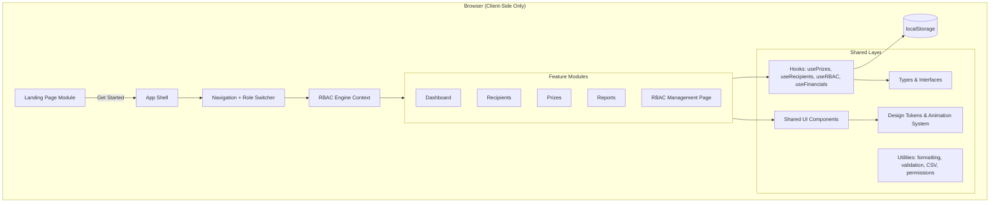
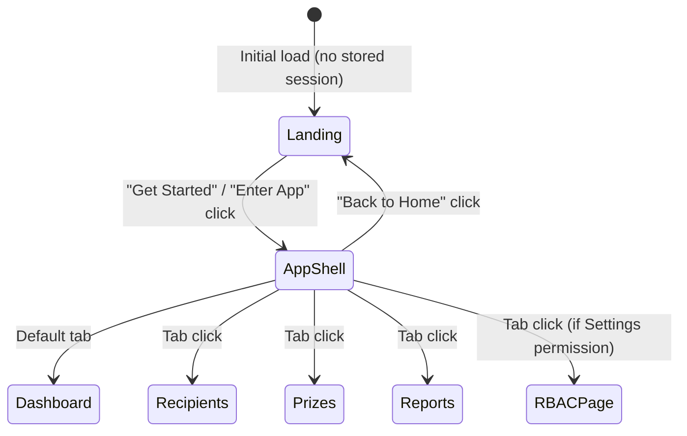

# Technical Design Document: PrizeFlow Evolution

## Overview

PrizeFlow Evolution transforms the existing prize distribution application into a polished, production-quality MVP by introducing four major enhancement areas:

1. **Landing Page** — A marketing-oriented entry point that communicates the product value proposition before users enter the application shell.
2. **Financial Management** — Extension of the Prize data model with monetary tracking, currency support, budget summaries, and financial reporting.
3. **Role-Based Access Control (RBAC)** — A client-side permission engine with a role switcher for previewing access control behavior across seven defined roles.
4. **UX & Information Architecture** — Animations, empty states, typography system, and navigation improvements.

All enhancements preserve existing functionality, maintain the client-side-only architecture (no backend), persist data via localStorage, and remain deployable on Vercel.

### Design Principles

- **Additive-only changes**: Existing data structures gain new optional fields; no existing fields are removed or renamed.
- **Graceful degradation**: Missing or corrupt data falls back to safe defaults without crashing.
- **Separation of concerns**: Each feature area lives in its own module under `src/features/` with shared utilities extracted to `src/shared/`.
- **Accessibility**: All interactive elements remain keyboard-navigable with ARIA attributes and WCAG AA contrast compliance.

---

## Architecture

### High-Level System Diagram



### Application Routing Strategy

Since PrizeFlow uses tab-based navigation (no router library), we introduce a top-level view state:



The top-level `App.tsx` will manage a `view` state (`'landing' | 'app'`) alongside the existing `activeTab` state. The landing page renders when `view === 'landing'`; the app shell renders when `view === 'app'`.

### Module Structure

```
src/
├── features/
│   ├── landing/           # NEW: Landing page module
│   │   ├── components/
│   │   │   ├── Landing.tsx
│   │   │   ├── HeroSection.tsx
│   │   │   ├── ProblemSection.tsx
│   │   │   ├── SolutionSection.tsx
│   │   │   ├── FeaturesSection.tsx
│   │   │   ├── WhySection.tsx
│   │   │   ├── CtaSection.tsx
│   │   │   ├── LandingNav.tsx
│   │   │   └── index.ts
│   │   └── index.ts
│   ├── rbac/              # NEW: RBAC management page
│   │   ├── components/
│   │   │   ├── RBACPage.tsx
│   │   │   ├── PermissionMatrix.tsx
│   │   │   ├── RoleDetailPanel.tsx
│   │   │   ├── PermissionLegend.tsx
│   │   │   └── index.ts
│   │   ├── hooks/
│   │   │   └── index.ts
│   │   └── index.ts
│   ├── dashboard/         # EXTENDED: Financial summary cards
│   ├── prizes/            # EXTENDED: Financial fields in forms
│   ├── recipients/        # UNCHANGED
│   └── reports/           # EXTENDED: Financial columns + summary
├── shared/
│   ├── components/        # EXTENDED: New shared components
│   │   ├── EmptyState.tsx # EXISTS - will be enhanced
│   │   ├── RoleSwitcher.tsx    # NEW
│   │   ├── CurrencySelector.tsx # NEW
│   │   ├── AnimatedList.tsx     # NEW
│   │   └── ...
│   ├── hooks/
│   │   ├── useRBAC.ts         # NEW: RBAC context + hook
│   │   ├── useFinancialSummary.ts  # NEW
│   │   └── ...
│   ├── rbac/              # NEW: RBAC engine (pure logic)
│   │   ├── permissions.ts      # Permission matrix data
│   │   ├── engine.ts           # Permission evaluation functions
│   │   └── types.ts            # RBAC type definitions
│   ├── types/
│   │   └── index.ts       # EXTENDED with financial + RBAC types
│   ├── utils/
│   │   ├── currency.ts    # NEW: Currency formatting
│   │   ├── financialCalc.ts # NEW: Budget calculations
│   │   └── migration.ts   # NEW: localStorage data migration
│   └── styles/
│       └── tokens.ts      # EXTENDED: Animation + typography tokens
```

---

## Components and Interfaces

### Landing Page Components

#### `Landing` (Container)
```typescript
interface LandingProps {
  onEnterApp: () => void;
}
```
Orchestrates all landing page sections. Passes `onEnterApp` callback to CTA buttons and nav.

#### `HeroSection`
```typescript
interface HeroSectionProps {
  onGetStarted: () => void;
}
```
Renders: product name, value proposition (≤150 chars), primary CTA button, and dashboard preview illustration. Responsive: side-by-side on ≥768px, stacked on mobile.

#### `LandingNav`
```typescript
interface LandingNavProps {
  onEnterApp: () => void;
}
```
Fixed header with PrizeFlow logo and "Enter App" link. Both elements keyboard-focusable with visible focus indicators.

### RBAC Components

#### `RoleSwitcher`
```typescript
interface RoleSwitcherProps {
  currentRole: RoleName;
  onRoleChange: (role: RoleName) => void;
}
```
Dropdown selector in the navigation area. Keyboard-navigable, screen-reader labeled. Displays current role name visibly at all times.

#### `PermissionMatrix`
```typescript
interface PermissionMatrixProps {
  roles: RoleName[];
  categories: FeatureCategory[];
  matrix: PermissionMatrixData;
  onRoleSelect: (role: RoleName) => void;
  selectedRole: RoleName | null;
}
```
Table rendering roles as columns, feature category / permission level combinations as rows.

#### `RoleDetailPanel`
```typescript
interface RoleDetailPanelProps {
  role: RoleName;
  permissions: RolePermissions;
}
```
Displays all feature categories and their granted permission levels for a selected role with descriptions.

### Financial Components

#### Enhanced `PrizeForm`
The existing `PrizeForm` will be extended with optional financial fields:
```typescript
interface PrizeFormData {
  name: string;
  description: string;
  // New financial fields
  prizeValue: number | null;
  currency: SupportedCurrency;
  prizeType: PrizeType;
  fundingSource: string | null;
  sponsor: string | null;
  budgetCategory: string | null;
  distributionStatus: DistributionStatus;
}
```

#### `FinancialSummaryCards`
```typescript
interface FinancialSummaryCardsProps {
  prizes: Prize[];
}
```
Renders: Total Prize Budget, Total Distributed Value, Remaining Budget, Cash Awards Count, Physical Awards Count. Groups by currency when multiple currencies exist.

#### `CurrencySelector`
```typescript
interface CurrencySelectorProps {
  value: SupportedCurrency;
  onChange: (currency: SupportedCurrency) => void;
  disabled?: boolean;
}
```
Dropdown listing supported ISO 4217 codes: USD, EUR, GBP, JPY, CAD, AUD, CHF, INR.

### Shared UI Enhancements

#### `AnimatedList`
```typescript
interface AnimatedListProps<T> {
  items: T[];
  keyExtractor: (item: T) => string;
  renderItem: (item: T) => React.ReactNode;
  emptyState?: React.ReactNode;
}
```
Wraps list rendering with fade-in for additions and fade-out for removals (respects `prefers-reduced-motion`).

### RBAC Engine (Pure Logic)

#### Permission Evaluation
```typescript
// Check if a role has a specific permission for a category
function hasPermission(
  role: RoleName,
  category: FeatureCategory,
  level: PermissionLevel
): boolean;

// Get all permissions for a role
function getRolePermissions(role: RoleName): RolePermissions;

// Check if a navigation tab should be visible for a role
function isTabVisible(role: RoleName, tabId: TabId): boolean;

// Check if an action button should be enabled for a role
function isActionEnabled(
  role: RoleName,
  category: FeatureCategory,
  action: PermissionLevel
): boolean;
```

### Financial Calculation Utilities

```typescript
// Calculate budget summary for a set of prizes
function calculateBudgetSummary(prizes: Prize[]): BudgetSummary;

// Calculate per-currency totals
function calculateCurrencyTotals(prizes: Prize[]): CurrencyTotal[];

// Determine the dominant currency for display
function getDominantCurrency(prizes: Prize[]): SupportedCurrency;

// Format a monetary value with currency
function formatCurrencyValue(
  value: number,
  currency: SupportedCurrency
): string;

// Validate a prize value input
function validatePrizeValue(input: string): ValidationResult;
```

### RBAC Context Provider

```typescript
interface RBACContextValue {
  currentRole: RoleName;
  setRole: (role: RoleName) => void;
  hasPermission: (category: FeatureCategory, level: PermissionLevel) => boolean;
  isTabVisible: (tabId: TabId) => boolean;
  isActionEnabled: (category: FeatureCategory, action: PermissionLevel) => boolean;
  isDegraded: boolean; // true if permission matrix is unavailable
}
```

The RBAC context wraps the entire App Shell, providing permission checks to all child components. The context reads the active role from localStorage on mount and persists changes.

---

## Data Models

### Extended Prize Type

```typescript
// Supported currencies (ISO 4217)
type SupportedCurrency = 'USD' | 'EUR' | 'GBP' | 'JPY' | 'CAD' | 'AUD' | 'CHF' | 'INR';

// Prize type enum
type PrizeType = 'cash' | 'physical';

// Distribution status enum
type DistributionStatus = 'pending' | 'in_progress' | 'distributed' | 'returned';

// Extended Prize interface (backward-compatible)
interface Prize {
  id: string;
  name: string;
  description: string;
  recipientId: string | null;
  claimed: boolean;
  claimDate: string | null;
  // New financial fields (all optional for backward compatibility)
  prizeValue: number | null;        // 0.01 - 999,999,999.99
  currency: SupportedCurrency;      // Default: 'USD'
  prizeType: PrizeType;             // Default: 'physical'
  fundingSource: string | null;     // Max 100 chars
  sponsor: string | null;           // Max 100 chars
  budgetCategory: string | null;    // Max 50 chars
  distributionStatus: DistributionStatus; // Default: 'pending'
}
```

### RBAC Types

```typescript
type RoleName =
  | 'Super Administrator'
  | 'Event Administrator'
  | 'Finance Officer'
  | 'Distribution Officer'
  | 'Staff'
  | 'Auditor'
  | 'Viewer';

type FeatureCategory =
  | 'Dashboard'
  | 'Recipients'
  | 'Teams'
  | 'Prize Management'
  | 'Financial Management'
  | 'Reports'
  | 'Settings'
  | 'Event Management';

type PermissionLevel =
  | 'View'
  | 'Create'
  | 'Edit'
  | 'Delete'
  | 'Export'
  | 'Assign'
  | 'Approve';

// The permission matrix is a nested record
type PermissionMatrixData = Record<RoleName, Record<FeatureCategory, PermissionLevel[]>>;

// Role permissions for a single role
type RolePermissions = Record<FeatureCategory, PermissionLevel[]>;
```

### Extended TabId

```typescript
type TabId = 'dashboard' | 'recipients' | 'prizes' | 'reports' | 'rbac';
```

### Financial Summary Types

```typescript
interface BudgetSummary {
  totalBudget: number;
  totalDistributed: number;
  remainingBudget: number;
  cashAwardsCount: number;
  physicalAwardsCount: number;
}

interface CurrencyTotal {
  currency: SupportedCurrency;
  total: number;
  distributedTotal: number;
  remaining: number;
  count: number;
}
```

### localStorage Keys and Migration

| Key | Data | Migration Strategy |
|-----|------|-------------------|
| `prizeflow_prizes` | `Prize[]` | Add defaults for missing financial fields |
| `prizeflow_recipients` | `Recipient[]` | No changes needed |
| `prizeflow_role` | `RoleName` | New key, defaults to "Super Administrator" |
| `prizeflow_view` | `'landing' \| 'app'` | New key, defaults to "landing" for first visit |

#### Migration Algorithm

```typescript
function migratePrizes(raw: unknown[]): Prize[] {
  return raw.map(item => {
    const prize = item as Record<string, unknown>;
    return {
      // Preserve existing fields exactly
      id: prize.id as string,
      name: prize.name as string,
      description: prize.description as string,
      recipientId: prize.recipientId as string | null,
      claimed: prize.claimed as boolean,
      claimDate: prize.claimDate as string | null,
      // Apply defaults for missing financial fields
      prizeValue: (prize.prizeValue as number) ?? null,
      currency: (prize.currency as SupportedCurrency) ?? 'USD',
      prizeType: (prize.prizeType as PrizeType) ?? 'physical',
      fundingSource: (prize.fundingSource as string) ?? null,
      sponsor: (prize.sponsor as string) ?? null,
      budgetCategory: (prize.budgetCategory as string) ?? null,
      distributionStatus: (prize.distributionStatus as DistributionStatus) ?? 'pending',
    };
  });
}
```

If `JSON.parse` fails entirely, the system retains unparseable data in localStorage unmodified, falls back to empty arrays, and displays an error message.

### Permission Matrix Data (Static)

The permission matrix is defined as a static constant. Below is a condensed representation:

| Role | Dashboard | Recipients | Teams | Prize Mgmt | Financial Mgmt | Reports | Settings | Event Mgmt |
|------|-----------|-----------|-------|-----------|---------------|---------|----------|------------|
| Super Admin | All | All | All | All | All | All | All | All |
| Event Admin | All | All | All | All | — | V, E | — | All |
| Finance Officer | V | V | — | V | All | All | — | — |
| Distribution Officer | V | V, E, A | — | V, E, A | — | V | — | — |
| Staff | V | V | — | V | — | — | — | — |
| Auditor | V, E | V, E | V, E | V, E | V, E | V, E | V, E | V, E |
| Viewer | V | V | — | V | — | V | — | — |

Legend: V=View, C=Create, E=Edit/Export, D=Delete, A=Assign, Ap=Approve, All=all levels, —=no access

### Tab-to-FeatureCategory Mapping

```typescript
const TAB_CATEGORY_MAP: Record<TabId, FeatureCategory> = {
  dashboard: 'Dashboard',
  recipients: 'Recipients',
  prizes: 'Prize Management',
  reports: 'Reports',
  rbac: 'Settings',
};
```

---


## Correctness Properties

*A property is a characteristic or behavior that should hold true across all valid executions of a system — essentially, a formal statement about what the system should do. Properties serve as the bridge between human-readable specifications and machine-verifiable correctness guarantees.*

### Property 1: Migration preserves existing fields and applies correct defaults

*For any* legacy prize object (containing id, name, description, recipientId, claimed, claimDate but missing some or all financial fields), applying the migration function SHALL produce a prize object where all original field values are identical to the input AND all missing financial fields are populated with their specified defaults (currency: "USD", prizeType: "physical", distributionStatus: "pending", all nullable fields: null).

**Validates: Requirements 4.1, 16.5**

### Property 2: Prize data serialization round-trip

*For any* valid Prize object containing all fields (including financial data), serializing to JSON and deserializing back SHALL produce an object that is deeply equal to the original.

**Validates: Requirements 4.4**

### Property 3: Prize value validation correctness

*For any* numeric input value, the validation function SHALL accept values in the range [0.01, 999,999,999.99] and reject values less than 0.01 or greater than 999,999,999.99. *For any* non-numeric string input, the validation function SHALL reject it. *For any* empty/null input, the validation function SHALL accept it (as prizeValue is optional).

**Validates: Requirements 4.6**

### Property 4: Budget summary calculation correctness

*For any* array of Prize objects, the budget summary SHALL satisfy: totalBudget equals the sum of prizeValue for all prizes where prizeValue is not null and prizeValue > 0; totalDistributed equals the sum of prizeValue for prizes where distributionStatus is "distributed" and prizeValue > 0; remainingBudget equals totalBudget minus totalDistributed; cashAwardsCount equals the count of prizes where prizeType is "cash"; physicalAwardsCount equals the count of prizes where prizeType is "physical". Prizes with null or zero prizeValue SHALL be excluded from monetary sums.

**Validates: Requirements 5.1, 4.5, 6.3, 6.4, 6.5**

### Property 5: Dominant currency determination

*For any* array of Prize objects, the dominant currency function SHALL return the currency with the highest frequency among prizes that have prizeValue > 0. *For any* tie in frequency, it SHALL return the currency that appears on the most recently created prize among those tied currencies. *For any* empty array or array where all prizes have null prizeValue, it SHALL return "USD" as the default.

**Validates: Requirements 5.3**

### Property 6: Currency formatting

*For any* valid numeric amount and supported currency, the formatting function SHALL produce a string containing the ISO 4217 currency code followed by the amount with exactly 2 decimal places and locale-appropriate thousand separators — except for JPY which SHALL use 0 decimal places.

**Validates: Requirements 5.5, 7.2**

### Property 7: Per-currency budget grouping

*For any* array of Prize objects containing prizes with multiple currencies, the currency grouping function SHALL produce exactly one total entry per distinct currency that appears with prizeValue > 0, and the sum of each group's total SHALL equal the sum of prizeValues for prizes in that currency.

**Validates: Requirements 7.4**

### Property 8: Permission evaluation determinism and implicit View enforcement

*For any* role name and feature category/permission level combination, the hasPermission function SHALL always return the same boolean result (deterministic). Additionally, *for any* role and feature category where the role has any non-View permission (Create, Edit, Delete, Export, Assign, or Approve), the role SHALL also have View permission for that same category.

**Validates: Requirements 9.2, 9.10, 9.11**

### Property 9: RBAC UI enforcement matches permission matrix

*For any* role, the set of visible navigation tabs SHALL exactly equal the set of feature categories where the role has View permission. *For any* role, category, and action type (Create, Edit, Delete, Export), isActionEnabled SHALL return true if and only if the permission matrix grants that permission level to that role for that category.

**Validates: Requirements 10.1, 10.2, 10.3, 10.4, 10.5**

### Property 10: Role persistence round-trip

*For any* valid role name, storing it to localStorage and reading it back SHALL return the same role name. *For any* string that is not a valid role name, reading from localStorage SHALL fall back to "Super Administrator".

**Validates: Requirements 8.3, 8.6**

### Property 11: Empty state toggle correctness

*For any* view (recipients, prizes, dashboard, reports) and *for any* data array, if the array is empty then the empty state component SHALL be rendered and the data list SHALL not be rendered; if the array is non-empty then the data list SHALL be rendered and the empty state SHALL not be rendered.

**Validates: Requirements 13.1, 13.2, 13.3, 13.4, 13.5**

### Property 12: CSV export column ordering

*For any* set of enriched prize objects exported to CSV, the output SHALL contain the original columns (Prize Name, Recipient Type, Recipient Name, and optionally Claim Date) in their original order first, followed by the financial columns (Prize Value, Currency, Prize Type, Funding Source, Sponsor, Budget Category, Distribution Status) appended after.

**Validates: Requirements 6.2, 16.4**

### Property 13: Distribution status transitions are unrestricted

*For any* prize and *for any* pair of distribution statuses (source, target) drawn from {"pending", "in_progress", "distributed", "returned"}, the system SHALL allow the transition from source to target without rejection, including transitions where source equals target.

**Validates: Requirements 4.7**

---

## Error Handling

### localStorage Errors

| Scenario | Handling Strategy |
|----------|-------------------|
| `JSON.parse` fails on stored data | Retain raw data in localStorage unmodified, fall back to empty array, display error banner |
| `QuotaExceededError` on write | Retain value in memory, display persistent warning, continue operating |
| Missing financial fields in stored prizes | Apply defaults via migration (silent, no error shown) |
| Invalid role stored in localStorage | Fall back to "Super Administrator" (silent) |

### RBAC Engine Errors

| Scenario | Handling Strategy |
|----------|-------------------|
| Permission matrix constant is corrupted/unavailable | Fall back to Super Administrator permissions, show non-blocking warning indicator in nav |
| Unknown role name passed to engine | Return Super Administrator permissions as fallback |
| Unknown feature category | Return false for all permission checks (deny by default) |

### Financial Validation Errors

| Scenario | Handling Strategy |
|----------|-------------------|
| Non-numeric prizeValue input | Display inline validation error, prevent form submission |
| prizeValue out of range (< 0.01 or > 999,999,999.99) | Display inline validation error with acceptable range |
| Currency not in supported list | Fall back to USD (should not occur with dropdown selector) |

### Navigation Errors

| Scenario | Handling Strategy |
|----------|-------------------|
| Navigation callback throws during "Get Started" click | Catch error, remain on landing page, no blank screen |
| Attempting to navigate to restricted tab | Redirect to dashboard, show dismissible access-denied notification |

### General Error Boundary

The existing `ErrorBoundary` component wraps the main content area. Each new feature module should be wrapped individually to prevent cascading failures:
- Landing page errors → show fallback with "Enter App" link
- RBAC page errors → show fallback message, maintain navigation
- Financial calculation errors → show "—" placeholder values, log warning

---

## Testing Strategy

### Testing Approach

This feature uses a **dual testing approach**:

1. **Property-based tests** (using `fast-check` via `@fast-check/vitest`): Verify universal properties across randomly generated inputs for pure logic functions.
2. **Unit tests** (using `vitest` + `@testing-library/react`): Verify specific UI behaviors, edge cases, integration points, and rendering correctness.

### Property-Based Testing Configuration

- **Library**: `fast-check` (already in devDependencies) with `@fast-check/vitest` integration
- **Minimum iterations**: 100 per property test
- **Tag format**: `Feature: prizeflow-evolution, Property {number}: {property_text}`

### Test File Organization

```
src/
├── shared/
│   ├── rbac/
│   │   └── __tests__/
│   │       ├── engine.property.test.ts      # Properties 8, 9, 10
│   │       └── engine.test.ts               # Example-based role definitions (9.3-9.9)
│   ├── utils/
│   │   └── __tests__/
│   │       ├── migration.property.test.ts   # Property 1
│   │       ├── financialCalc.property.test.ts # Properties 4, 5, 7
│   │       ├── currency.property.test.ts    # Property 6
│   │       ├── validation.property.test.ts  # Property 3
│   │       └── csv.property.test.ts         # Property 12
│   ├── hooks/
│   │   └── __tests__/
│   │       └── usePrizes.property.test.ts   # Properties 2, 13
├── features/
│   ├── landing/
│   │   └── __tests__/
│   │       └── Landing.test.tsx             # Example-based (Reqs 1-3)
│   ├── dashboard/
│   │   └── __tests__/
│   │       ├── Dashboard.test.tsx           # Example-based (Req 5)
│   │       └── EmptyState.property.test.ts  # Property 11
│   ├── prizes/
│   │   └── __tests__/
│   │       └── PrizeForm.test.tsx           # Example-based (Reqs 4.2, 4.3)
│   ├── reports/
│   │   └── __tests__/
│   │       └── Reports.test.tsx             # Example-based (Req 6.1)
│   └── rbac/
│       └── __tests__/
│           └── RBACPage.test.tsx            # Example-based (Req 11)
```

### Property Test Implementation Notes

Each property test MUST:
- Run a minimum of 100 iterations
- Reference its design document property number in a comment tag
- Use `fast-check` arbitraries to generate valid and invalid inputs
- Be implementable as a single `fc.assert(fc.property(...))` call

### Unit Test Coverage Areas

| Area | Test Type | Key Scenarios |
|------|-----------|---------------|
| Landing page rendering | Example | Hero content, section order, CTA behavior |
| Landing responsive layout | Visual/Snapshot | Viewport-specific rendering |
| Prize form financial fields | Example | Field presence, defaults, validation errors |
| Dashboard financial cards | Example | Card rendering, zero-state message |
| Reports financial columns | Example | Column presence and ordering |
| RBAC page matrix | Example | Matrix structure, detail panel, legend |
| Role switcher | Example | Role list order, default selection, persistence |
| Navigation tabs (RBAC-filtered) | Example | Tab visibility per role |
| Disabled action buttons | Example | Disabled state, aria attributes, tooltips |
| Animations | Example | CSS class presence, prefers-reduced-motion |
| Empty states | Example | Rendering with empty/non-empty data |
| Backward compatibility | Integration | Existing CRUD operations unchanged |

### Regression Testing

All existing tests in `src/shared/hooks/__tests__/cascade-delete.property.test.ts` must continue to pass. The extended Prize type is backward-compatible, so existing test fixtures should work with minimal changes (financial fields default to their specified values).
