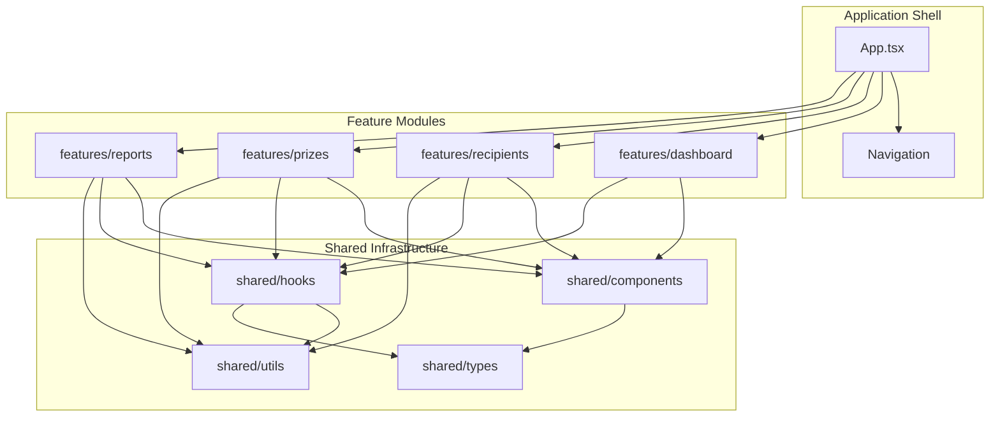

# Technical Design Document: Production-Quality MVP

## Overview

This design transforms PrizeFlow from a functional prototype into a production-quality MVP without adding new features. The effort focuses on eight cross-cutting concerns: file organization, design system, component library, accessibility, performance, state management, CSV export robustness, and responsive layout.

The application retains its existing domain model (Recipients, Prizes), localStorage persistence, and tab-based navigation. All changes are internal quality improvements that make the codebase maintainable, accessible, performant, and visually polished.

### Design Principles

1. **Progressive Enhancement** — Start with semantic HTML, layer CSS and JS behavior on top
2. **Single Source of Truth** — Design tokens in Tailwind config; state in custom hooks
3. **Composition over Inheritance** — Small components composed together, not monolithic widgets
4. **Module Isolation** — Feature modules never import directly from each other
5. **Graceful Degradation** — Storage failures don't crash the app; data stays in memory

---

## Architecture

### High-Level Architecture



### Project Structure

```
src/
├── features/
│   ├── dashboard/
│   │   ├── components/
│   │   │   └── DashboardCard.tsx
│   │   ├── hooks/
│   │   │   └── useDashboardStats.ts
│   │   └── index.ts
│   ├── recipients/
│   │   ├── components/
│   │   │   ├── RecipientForm.tsx
│   │   │   ├── RecipientList.tsx
│   │   │   └── RecipientRow.tsx
│   │   ├── hooks/
│   │   │   └── useRecipientSearch.ts
│   │   └── index.ts
│   ├── prizes/
│   │   ├── components/
│   │   │   ├── PrizeForm.tsx
│   │   │   ├── PrizeList.tsx
│   │   │   └── PrizeRow.tsx
│   │   ├── hooks/
│   │   │   └── usePrizeFilters.ts
│   │   └── index.ts
│   └── reports/
│       ├── components/
│       │   ├── ReportTable.tsx
│       │   └── ExportButton.tsx
│       ├── hooks/
│       │   └── useReportData.ts
│       └── index.ts
├── shared/
│   ├── components/
│   │   ├── Button.tsx
│   │   ├── Input.tsx
│   │   ├── Card.tsx
│   │   ├── Badge.tsx
│   │   ├── Table.tsx
│   │   ├── Dialog.tsx
│   │   ├── EmptyState.tsx
│   │   └── index.ts
│   ├── hooks/
│   │   ├── useLocalStorage.ts
│   │   ├── useFocusTrap.ts
│   │   ├── useArrowNavigation.ts
│   │   └── index.ts
│   ├── utils/
│   │   ├── storage.ts
│   │   ├── csv.ts
│   │   ├── id.ts
│   │   └── index.ts
│   ├── types/
│   │   └── index.ts
│   └── styles/
│       └── tokens.ts  (TypeScript constants mirroring Tailwind config for JS usage)
├── App.tsx
├── main.tsx
├── index.css
└── vite-env.d.ts
```

### Module Boundary Rules

1. Feature modules import only from `shared/` and never from other feature modules
2. Each feature module exposes a single `index.ts` barrel file
3. The application shell (`App.tsx`) imports only from feature module index files and `shared/`
4. `shared/` never imports from `features/`

---

## Components and Interfaces

### Shared Component Library

#### Button

```typescript
interface ButtonProps extends React.ButtonHTMLAttributes<HTMLButtonElement> {
  variant?: 'primary' | 'secondary' | 'danger' | 'success';
  size?: 'default' | 'small';
}
```

- Renders `<button>` with variant-derived Tailwind classes
- Applies `opacity-50 cursor-not-allowed pointer-events-none` when `disabled`
- Includes `active:scale-95` press animation (150ms)
- Forwards ref via `React.forwardRef`

#### Input

```typescript
interface InputProps extends React.InputHTMLAttributes<HTMLInputElement> {
  label: string;
  error?: string;
  id: string;
}
```

- Renders `<label>` linked via `htmlFor={id}`
- Shows red border (`border-danger-500`) and error text below when `error` is provided
- Error text linked to input via `aria-describedby`
- Required fields show `*` after label and `required` attribute on input

#### Card

```typescript
interface CardProps extends React.HTMLAttributes<HTMLDivElement> {
  children: React.ReactNode;
}
```

- Renders a `<div>` with `bg-white rounded-lg shadow-sm border border-neutral-200 p-4`
- All padding/shadow/radius values come from design tokens

#### Badge

```typescript
interface BadgeProps {
  variant: 'success' | 'warning' | 'neutral';
  children: React.ReactNode;
  className?: string;
}
```

- Small pill-shaped element with semantic background and text colors
- Includes `transition-colors duration-normal` for animated status changes

#### Table (Compound Component)

```typescript
interface TableProps extends React.TableHTMLAttributes<HTMLTableElement> {
  children: React.ReactNode;
}

// Sub-components
Table.Head: React.FC<{ children: React.ReactNode }>
Table.Body: React.FC<{ children: React.ReactNode }>
Table.Row: React.FC<{ children: React.ReactNode; highlighted?: boolean }>
Table.HeaderCell: React.FC<{ children: React.ReactNode }> // renders <th scope="col">
Table.Cell: React.FC<{ children: React.ReactNode }>
```

- Wraps in a horizontally-scrollable container for responsiveness
- Header cells automatically get `scope="col"`
- Alternating row backgrounds via `even:bg-neutral-50`

#### Dialog

```typescript
interface DialogProps {
  open: boolean;
  onClose: () => void;
  title: string;
  children: React.ReactNode;
  triggerRef?: React.RefObject<HTMLElement>;
}
```

- Uses `<dialog>` element or `role="dialog" aria-modal="true"`
- Implements focus trapping via `useFocusTrap` hook
- On open: moves focus to first focusable child
- On close: returns focus to `triggerRef` element
- Dismisses on Escape key or backdrop click
- Backdrop renders as inert overlay preventing background interaction

#### EmptyState

```typescript
interface EmptyStateProps {
  heading: string;
  description: string;
  actionLabel?: string;
  onAction?: () => void;
  icon?: React.ReactNode;
}
```

- Centered layout with icon, heading, description, and optional CTA button
- CTA uses `Button` component with `variant="primary"`

### Custom Hooks

#### useLocalStorage\<T\>

```typescript
interface StorageResult<T> {
  data: T;
  error: string | null;
}

function useLocalStorage<T>(key: string, defaultValue: T): {
  value: T;
  setValue: (newValue: T | ((prev: T) => T)) => void;
  error: string | null;
};
```

- Reads from localStorage on mount with JSON.parse
- If parse fails or value is not valid, returns `defaultValue` and logs warning
- On write failure (QuotaExceededError), retains value in memory and sets `error`
- Memoizes `setValue` with `useCallback`

#### useFocusTrap

```typescript
function useFocusTrap(containerRef: React.RefObject<HTMLElement>, active: boolean): void;
```

- When `active`, intercepts Tab/Shift+Tab to cycle focus within container
- Queries all focusable elements (`button, [href], input, select, textarea, [tabindex]:not([tabindex="-1"])`)
- On last element + Tab → focus first; on first element + Shift+Tab → focus last

#### useArrowNavigation

```typescript
function useArrowNavigation(
  containerRef: React.RefObject<HTMLElement>,
  options: { orientation: 'horizontal' | 'vertical'; loop: boolean }
): void;
```

- Listens for Arrow keys within container
- Moves focus/selection between focusable children
- Wraps when `loop: true` (last → first, first → last)

#### useRecipients / usePrizes (Feature Hooks)

```typescript
function useRecipients(): {
  recipients: Recipient[];
  addRecipient: (name: string, contact: string) => void;
  updateRecipient: (id: string, updates: Partial<Omit<Recipient, 'id'>>) => void;
  deleteRecipient: (id: string) => void;
};

function usePrizes(): {
  prizes: Prize[];
  addPrize: (name: string, description: string) => void;
  updatePrize: (id: string, updates: Partial<Omit<Prize, 'id'>>) => void;
  deletePrize: (id: string) => void;
  assignRecipient: (prizeId: string, recipientId: string) => void;
  claimPrize: (prizeId: string) => void;
  unclaimPrize: (prizeId: string) => void;
};
```

- Built on `useLocalStorage`
- `deleteRecipient` performs cascade: clears `recipientId`, `claimed`, and `claimDate` on all prizes referencing that recipient
- All mutation functions memoized with `useCallback`

---

## Data Models

### Domain Types (unchanged)

```typescript
export interface Recipient {
  id: string;
  name: string;
  contact: string;
}

export interface Prize {
  id: string;
  name: string;
  description: string;
  recipientId: string | null;
  claimed: boolean;
  claimDate: string | null; // ISO 8601: YYYY-MM-DD
}

export type TabId = 'dashboard' | 'recipients' | 'prizes' | 'reports';
```

### New Infrastructure Types

```typescript
// Storage result for graceful degradation
export interface StorageResult<T> {
  data: T;
  error: string | null;
}

// Component variant types
export type ButtonVariant = 'primary' | 'secondary' | 'danger' | 'success';
export type ButtonSize = 'default' | 'small';
export type BadgeVariant = 'success' | 'warning' | 'neutral';
```

### Design Token Types

```typescript
// Mirrors Tailwind config for programmatic access
export const COLORS = {
  primary: { 50: '...', /* 100-900 */ },
  neutral: { 50: '...', /* 100-900 */ },
  success: { 50: '...', /* 100-900 */ },
  warning: { 50: '...', /* 100-900 */ },
  danger: { 50: '...', /* 100-900 */ },
} as const;

export const TRANSITIONS = {
  fast: '150ms',
  normal: '200ms',
  slow: '300ms',
} as const;

export const RADII = {
  sm: '4px',
  md: '8px',
  lg: '12px',
  xl: '16px',
  full: '9999px',
} as const;
```

### CSV Serializer Interface

```typescript
interface CsvOptions {
  columns: string[];
  bom?: boolean;       // default: true
  crlf?: boolean;      // default: true
}

// Pure function — no DOM side effects
function serializeCsv(rows: Record<string, string>[], options: CsvOptions): string;

// Pure function — parses CSV string back to rows
function parseCsv(csv: string, options: { columns: string[] }): Record<string, string>[];

// Side-effect function — triggers download
function downloadCsv(filename: string, content: string): void;
```

Separation of concerns: `serializeCsv` and `parseCsv` are pure and testable; `downloadCsv` handles browser I/O.

---

## Correctness Properties

*A property is a characteristic or behavior that should hold true across all valid executions of a system — essentially, a formal statement about what the system should do. Properties serve as the bridge between human-readable specifications and machine-verifiable correctness guarantees.*

### Property 1: Storage Integrity (Round-Trip)

*For any* valid array of Recipient objects and *for any* valid array of Prize objects, serializing the array to localStorage via the Storage_Layer and then deserializing it back SHALL produce an array that is deeply equal to the original.

**Validates: Requirements 9.2**

### Property 2: CSV Round-Trip

*For any* Prize object with a non-empty name and a claim date in ISO 8601 format (YYYY-MM-DD), and *for any* associated Recipient with a non-empty name, serializing the prize data to a CSV row using `serializeCsv` and then parsing that CSV row back using `parseCsv` SHALL produce field values that are character-for-character identical to the original prize name, recipient name, and claim date string.

**Validates: Requirements 10.10, 10.1, 10.2, 10.3, 10.8**

### Property 3: CSV Field Isolation

*For any* two adjacent CSV fields where one field contains an arbitrary combination of commas, double quotes, and newline characters, serializing and parsing SHALL produce the correct original values for both fields without one field's special characters corrupting the adjacent field's value.

**Validates: Requirements 10.1, 10.2, 10.3**

### Property 4: Cascade Delete Consistency

*For any* list of recipients and *for any* list of prizes with arbitrary recipient assignments, after executing `deleteRecipient(id)`, no prize in the resulting list SHALL have `recipientId` equal to the deleted recipient's `id`, and no prize referencing the deleted recipient SHALL have `claimed === true` or a non-null `claimDate`.

**Validates: Requirements 9.5**

### Property 5: Focus Trap Containment

*For any* set of focusable elements within an active Dialog and *for any* sequence of Tab and Shift+Tab key presses, the focused element SHALL always remain within the set of focusable elements inside the Dialog — focus never escapes to elements outside the Dialog boundary.

**Validates: Requirements 3.6, 6.6**

### Property 6: Arrow Key Navigation Wrapping

*For any* tab list containing N tabs (N ≥ 2) and *for any* starting active tab index, pressing the Right Arrow key N times SHALL cycle through all tabs and return focus to the original tab, and pressing the Left Arrow key N times SHALL similarly complete a full cycle in the opposite direction.

**Validates: Requirements 6.10**

### Property 7: Filter Subset Correctness

*For any* list of recipients (or prizes) and *for any* non-empty search query string, the filtered result list SHALL be a strict subset of the original list where every item in the filtered result contains the query string (case-insensitive) in at least one searchable field, and no item in the original list matching the predicate is excluded from the filtered result.

**Validates: Requirements 7.4** (implicitly — correctness of the filtering logic that enables the 300ms performance target)

---

## Error Handling

### Storage Layer Errors

| Scenario | Behavior |
|----------|----------|
| `localStorage.getItem` returns invalid JSON | Return default empty array; `console.warn` with key name |
| `localStorage.getItem` returns valid JSON but not an array | Return default empty array; `console.warn` |
| `localStorage.setItem` throws `QuotaExceededError` | Retain state in memory; set `error` on hook return; show non-blocking toast/banner |
| `localStorage` unavailable (private browsing) | Fall back to in-memory-only mode; warn user on first write attempt |

### CSV Export Errors

| Scenario | Behavior |
|----------|----------|
| Empty data set (0 rows) | Export file with header row only |
| Field value is `null` or `undefined` | Serialize as empty string |
| `URL.createObjectURL` fails | Show error message; do not crash |

### Component Error Boundaries

- Each feature module wraps its top-level component in a lightweight error boundary
- Error boundary renders a recovery message with a "Reload" button
- Errors are logged to `console.error` (no external service in MVP)

### Form Validation

| Scenario | Behavior |
|----------|----------|
| Required field empty on submit | Show inline error below field; retain other field values; prevent submission |
| User corrects invalid field | Remove inline error within 100ms of valid input |
| Storage write fails after valid submission | Show non-blocking warning; form closes normally |

---

## Testing Strategy

### Testing Framework

- **Vitest** for unit and property-based tests (fast, Vite-native)
- **@testing-library/react** for component interaction tests
- **fast-check** for property-based testing (JavaScript PBT library)

### Test Categories

#### 1. Property-Based Tests (fast-check)

Each correctness property maps to a single `fc.assert(fc.property(...))` test. Configuration:
- Minimum 100 iterations per property (`numRuns: 100`)
- Each test tagged with: `// Feature: production-quality-mvp, Property N: <title>`

Target modules:
- `shared/utils/storage.ts` — Property 1 (Storage Integrity)
- `shared/utils/csv.ts` — Properties 2, 3 (CSV Round-Trip, Field Isolation)
- State hooks cascade logic — Property 4 (Cascade Delete)
- `shared/hooks/useFocusTrap.ts` — Property 5 (Focus Trap)
- `shared/hooks/useArrowNavigation.ts` — Property 6 (Arrow Nav)
- Recipient/Prize filter logic — Property 7 (Filter Subset)

#### 2. Unit Tests (Vitest + Testing Library)

- Component library: Each shared component gets example-based tests verifying variants render correctly, disabled states work, accessibility attributes are present
- Empty states: Tests for each empty state scenario (Requirements 4.1–4.6)
- Form validation: Tests for inline errors, focus management, Escape dismissal
- Design token validation: Tests confirming Tailwind config contains required tokens

#### 3. Integration Tests

- Navigation flow: Tab switching renders correct content
- CRUD workflows: Add/edit/delete recipient and prize end-to-end
- Dialog lifecycle: Open → interact → confirm/cancel → focus restoration
- CSV export: Full export flow with real data producing valid file content

#### 4. Performance Tests

- Bundle size check in CI (`vite build` output < 200KB gzipped)
- LCP measurement with simulated 500-item dataset (target: < 2s)

### Test File Location

Tests co-locate with the module they test:
```
src/shared/utils/__tests__/csv.test.ts
src/shared/utils/__tests__/csv.property.test.ts
src/shared/hooks/__tests__/useFocusTrap.test.ts
src/features/recipients/__tests__/RecipientList.test.ts
```

### Property Test Configuration

```typescript
import fc from 'fast-check';

// Example: CSV Round-Trip property
// Feature: production-quality-mvp, Property 2: CSV Round-Trip
test('csvParse(csvSerialize(prize)) produces identical field values', () => {
  fc.assert(
    fc.property(
      fc.record({
        name: fc.string({ minLength: 1 }),
        recipientName: fc.string({ minLength: 1 }),
        claimDate: fc.date().map(d => d.toISOString().slice(0, 10)),
      }),
      (fields) => {
        const serialized = serializeCsv([fields], { columns: ['name', 'recipientName', 'claimDate'] });
        const parsed = parseCsv(serialized, { columns: ['name', 'recipientName', 'claimDate'] });
        expect(parsed[0]).toEqual(fields);
      }
    ),
    { numRuns: 100 }
  );
});
```
